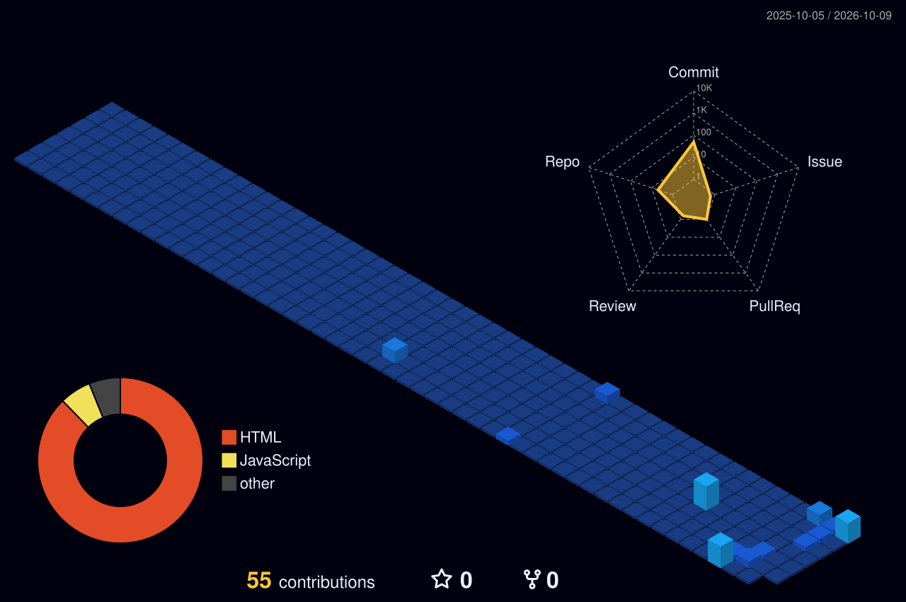

<picture>
  <source media="(max-width: 640px)" srcset="id-dashboard-mobile.svg?v-1">
  
</picture>

## Featured projects

| Project | What it is | Stack | Link |
| --- | --- | --- | --- |
| **Project One** | Short one-line description of what it does | React, Node.js | [Live](https://zainkhan-portfolio.vercel.app/#projects) |
| **Project Two** | Short one-line description of what it does | Next.js, Tailwind | [Live](https://zainkhan-portfolio.vercel.app/#projects) |
| **Project Three** | Short one-line description of what it does | Python, AI | [Live](https://zainkhan-portfolio.vercel.app/#projects) |

> Replace the rows above with your real projects. More work is on my [portfolio](https://zainkhan-portfolio.vercel.app/#projects).

## Contribution city

[LinkedIn](https://www.linkedin.com/in/zainulabideenkhan97/) &nbsp;·&nbsp; [Portfolio](https://zainkhan-portfolio.vercel.app/) &nbsp;·&nbsp; [Email](mailto:zainkhan972005@gmail.com)

